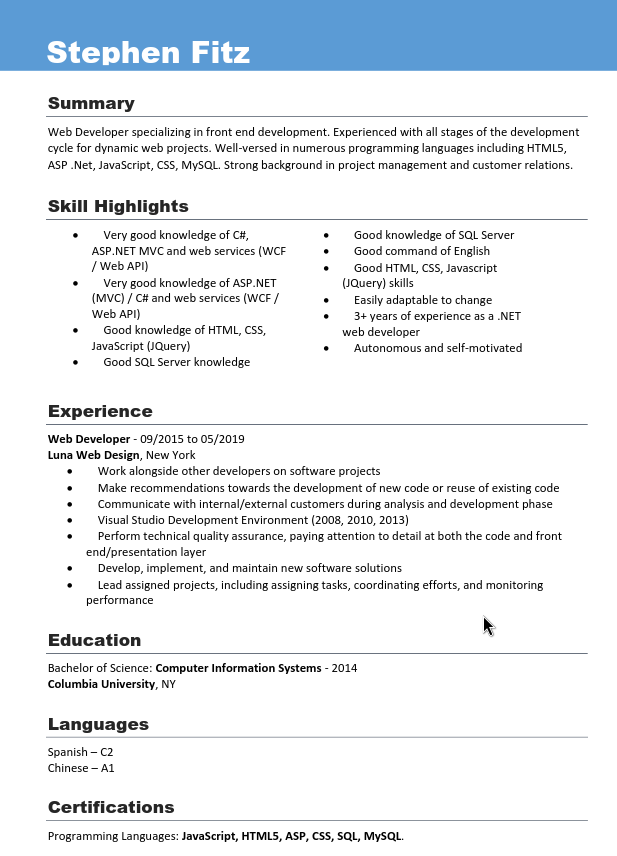
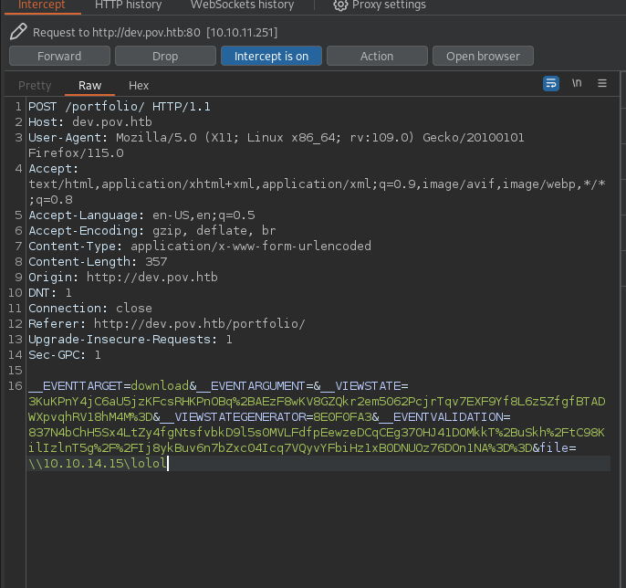
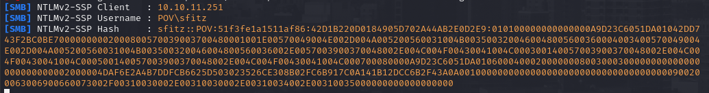
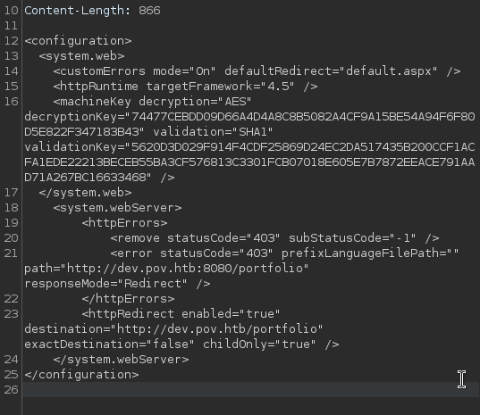
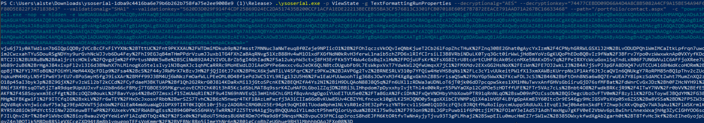
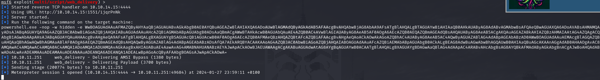

# id

* class deserialization
* lorem

# title

Insecure Deserialization

# description

Deserialization process take as input a format structured data and rebuilding into an object (eg:/ JSON, XML). 
This process is potential harmful when the deserialization string is user-controllable, manipulate the structured data
could lead to command or object injection making the desrialization process the attack vector. Attackers needs to know the
type of deserialization (eg:/ PHP, Java) and craft the serialized object exploiting known gadget that would be handled and
executed by the victim machine (similar to ROP chain). The common impact of this vulnerability is RCE.

**Context**

Here I will cover the first part of the machine called POV, in order to exploit an ASPX insecure deserialization
you need to find the decryption and validation keys through a LFI. With this 2 requirements I was able to craft
the malicious ASP.NET serialized object that would be injected into the ViewState POST parameter to get a meterpeter
shell.

# evidence

## dev.pov.htb
During reconnaissance it has been found that the machine `pov.htb` have only the HTTP service (port 80) open and available to the public. The base
domain is a static brochoure of the website where no interaction can be achieved. Subdomain bruteforcing (with **ffuf** tool) found `dev.pov.htb` which
look interesting compared to the base domain. Here we have an overview of the (potential) backend technology thanks of a CV which can be downloaded through
the endpoint `/portfolio` {!REF:2:POV:issue.md:issue21.png!}. Looking closer the request with BURP the CV file is fetched through a POST parameter (`file`),
I played with this changing the value and discover an LFI and RFI was possible. Knowing this I fired up Responder and use the LFI to fetch a file on the rogue
SMB server in order to grab username and NTLMv2 Hash {!REF:2:POV:issue.md:issue22.png!} {!REF:2:POV:issue.md:issue23.png!}.
The hash was uncrackable but at least we have harvested a valid machine username, plus inspecting the request highlight the presence of **ViewState** POST parameter.
**ViewState** is used for session authenticaion (similar to cookies) and is well known that is vulnerable to **Insecure Deserialization** when is user controllable but 
we need more info about the validation/decryption key/alghorithm if we want to properly inject it without throwing an error. Without covering all the trial-&-error I made
using the LFI pointing to `../web.config` uncover all the data we need to go further {!REF:2:POV:issue.md:issue24.png!}. I create the ASPX malicious object using ysoserial
with the following flags :

* **-p = ViewState**
* **-g TextFormattingRunProperties**
* **--decryptionalg="AES"**
* **--decryptionkey={AES_KEY}**
* **--validationalg="SHA1"**
* **--validationkey={SHA1_KEY}**
* **--path=/portfolio/contact.aspx** (can be whatever ASPX page)
* **-c {payload for web_delivery metasploit module}**

Finally we have crafted our own ViewState object and is ready to be injected {!REF:2:POV:issue.md:issue25.png!}, now we can make a new request and change the original ViewState
with the crafted one, after that a meterpeter shell as **web_svc** user will popout {!REF:2:POV:issue.md:issue26.png!}. Foothold has been achieved!

**SSVC Decision**

* **Exploitation = PoC**, because *"the vulnerability has a well known method of exploitation"*
* **Automable = Yes**, we automatically achieved RCE with the successful exploitation of the vulnerability
* **Technical Impact = Partial**, we are spawning as low privileges user so our potential damage is reduced and need additional steps to go further
* **Mission & Well-Being = Medium**, the vulnerable component is a simple workstation with no esential component for the client mission
* **Decision = Track**, the sum of the previous choices

# affected assets

* dev.pov.htb (port 80)

# severity

Track
SSVCv2/E:P/A:Y/T:P/P:S/B:M/M:M/D:T

# recommendations

* The LFI is the key factor that allowed insecure deserialization to occur. Instead of using a parameter to fetch the file, create ad-hoc function to grab just the CV without the need of user-controllable parameters
* Never ever deserialize untrusted data, it would not be that simple as it sound but is a risk with relevant consequence
* Check the library used for serialization/deserialization process in order to find some flags/options to prevent code execution
* Removing/Disabling specific gadget can create a cascade effect on the whole infrastructure generating issues and errors. Do it but at your own risk and make proper testing, future implementation could suffer from that so is not suggested if not strictly needed

# references

* [My full walkthrough of POV machine](https://github.com/alstephh/This_Is_Just_A_Hobby/tree/main/MACHINES/HTB/POV)

# images

* 
* 
* 
* 
* 
* 
