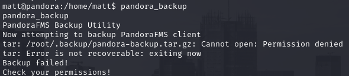
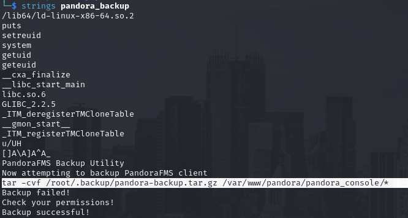
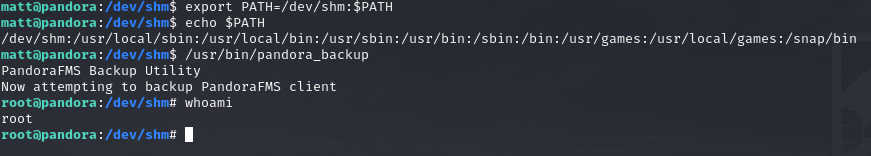

# id

* class Hijacking
* lorem

# title

Path Hijacking

# description

The use of relative path inside codes could lead to Path Hijacking, the attacker change the $PATH variable in order
to execute malicious costumversion of program instead the originals one. This doesn't target a specific programming language the
only requirement is to call binaries or program at OS level. The attack is defined under the "Hijack Execution Flow" definition where
an attacker abuse a pre-exisisting code in order to perform unwanted action. Is one of the basic methods of Privilege Escalation especially
in Unix system where costum program with SUID/SUDO permissions allow to get root from low privilege users. 

**Context**

Here we will cover the privilege escalation section of th machine **Pandora**, I get foothold through a well-known exploit of a vulnerable
version of PandoraFMS (`v7.0NG.742`) which is a SQL injection that can be leverage to RCE on the machine. I got access as `matt` user
and found a SUID program which is vulnerable to Path Hijacking to get RCE as `root`.

# evidence

## pandora

With simple enumeration it didn't take much before I discovered a costum SUID binary called **"pandora_backup"** which is a simple backup
tool for PandoraFMS {!REF:3:PANDORA:issue.md:issue31.png!}. Without downloading locally the file and do reverse engineering I tried to use
`strings` linux utility to put an eye of the binary content, luckly it was not that complex and I see the gap that permits exploitation through
Path Hijacking. The binary call `tar` but without the absolute path and without forcing a standard PATH variable inside the code {!REF:3:PANDORA:issue.md:issue32.png!}.
I moved into `/dev/shm` and create a version of `tar` that just spawn a bash process, change the PATH enviroment variable giving precedence to this directory
with `EXPORT PATH=/dev/shm:$PATH` and than reuse `pandora_backup`. This time it will not finish because when it hit `tar` command will spawn a shell as root thanks
to the SUID {!REF:3:PANDORA:issue.md:issue33.png!}.

**SSVC Decision**

* **Exploitation = Active**, Hijacking Execution flow has been one of the most used technique is [2019-2021](https://web.mitre-engenuity.org/hubfs/Center%20for%20Threat%20Informed%20Defense/CTID-Sightings-Ecosystem-Report.pdf) even if is reduced is use is one of the favorite tricks by threat in the wild
* **Automable = No**, the steps from 1 to 4 are not fully automable and requires manual enumeration to discover the vulnerability (like reverse engineering)
* **Technical Impact = Total**, not just RCE has been achieved but high-level RCE because the SUID that permits to impersonate root user
* **Mission & Well-Being = High**, the vulnerable component is not a simple webserver but host the Pandora FMS monitoring software which can lead to remote control of other machines inside the network
* **Decision = Act**, the sum of the previous choices

# affected assets

* pandora machine

# severity

Act
SSVCv2/E:A/A:N/T:T/P:E/B:A/M:H/D:C

# recommendations

* Be aware when assign SUID or SUDO permissions to softwares, in this case a backup could be done by a service account or an high-privilege profile which is not root.
* Costum binaries/tool should be full reviewed trying to avoid relative path and add an hardcoded PATH enviroment variable value to guard from Path Hijacking technique, same thing for DLL in Windows
* In general implement the least-privilege principle in every aspects of your infrastructure, if is not a developer account it don't need to cahnge PATH enviroment variable

# references

* [My full walkthrough of Pandora machine](https://github.com/alstephh/This_Is_Just_A_Hobby/tree/main/MACHINES/HTB/Pandora)

# images

* 
* 
* 
