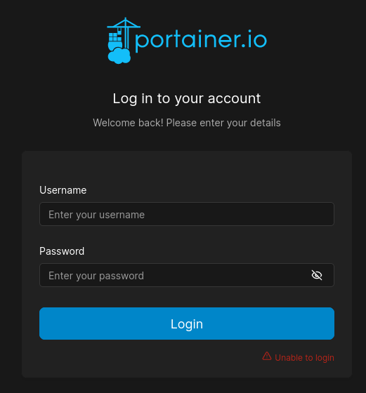
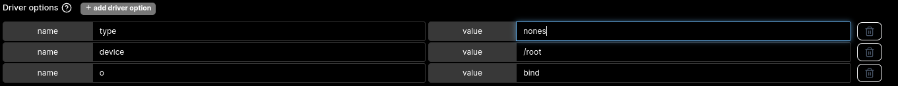
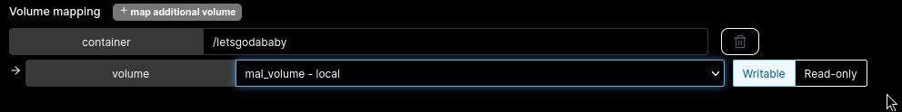
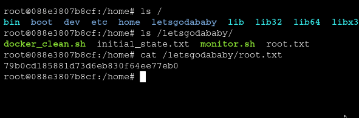

# id

* class Container
* lorem

# title

Container Administration Commands

# description
When adversary put their hands into container administration/orchestration can turn in dangerous consequence. There are various
technique for both RCE and privilege escalation (and more) involving Kubernetes or Docker and companies should be aware of it. From entrypoint
script to container escape makes this technologies a double-edge blade that needs to be handled carefully. Not to mention the flexibility and portability
of containers could be exploited for horizontal movement or pivoting.

**Context**

**Runner** machine is a medium machine where the user flag should be grabbed through the exploit of CVE-2024-27918 affecting some TeamCity versions that allows to remotely create
admin users without credentials. After login inside TC a private RSA key has been found and used to SSH inside the machine as `john`. Here Apache configuration file uncover a subdomain
called `portainer-administration.runner.htb` hosting **portainer.io** docker orchestration software. From here we can deploy pre-existing image into the machine and abusing mount-binding
I was able to retrieve the contents of `/root` folder and grab the flag.

# evidence

## portainer-administration.runner.htb

After enumerating the machine internally I visited the **portainer.io** subdomain which is shielded by the login form {!REF:4:RUNNER:issue.md:issue41.png!}. With Hydra I was able to retrieve the
passowrd of one of the users inside the machine, the valid credentials are `matthew:piper123`. Portainer.io is an UI orchestrator for Docker, the trick here is to translate every UI actions to
`docker-compose` flag but looking at the documentation was not that hard. There is justs one predefined image that we can use (a simple `ubuntu:latest`), my first idea was to create a container instance
where can reach a path reachable by the normal user, set a SUID bash as root (in the container) and than execute it in the bare-metal machine. I had some issue with this option (which is still possible) and
decide to abuse **mount-binding** option to link the `/root` directory to another directory inside the container which, as root, contents can be fetched freely. First I need to create a [**tmpfs storage**](https://docs.portainer.io/user/docker/volumes/add#adding-a-tmpfs-volume)
and set it as bind mount {!REF:4:RUNNER:issue.md:issue42.png!}. Save the storage and go in the deployment phase, set the storage volume just created and map it to a directory inside the container of your choice {!REF:4:RUNNER:issue.md:issue43.png!} and deploy the container
into the machine. When ready, we can finally read the content of the `/root` directory and read the final flag! {!REF:4:RUNNER:issue.md:issue44.png!}.

**SSVC Decision**

* **Exploitation = PoC**, Portainer.io is really helpfull for the attacker and can modularize the same exploit on different machine
* **Automable = No**, you need credentials for both the local machine and portainer.io (also not all accounts can perform all the actions), moreover port forwarding is required and the port can change in different networks making hard the creation of a single automation code for this vulnerability
* **Technical Impact = Total**, in this specific case we can set malicious containers in every machine into the network (in this case the network is a single machine) permitting to move horizontally, vertically and pivoting into other network
* **Mission & Well-Being = High**, container are used for different tasks inside the client network and a sabotage of 1+ container can buff threat capabilities 
* **Decision = Act**, the sum of the previous choices

# affected assets

* portainer-administration.runner.htb

# severity

Attend
SSVCv2/E:P/A:N/T:T/P:E/B:A/M:H/D:A

# recommendations

* Check the password policy and implement bruteforcing/logon attempt count mitigation technique even within internal services, a simple solution that can make the attackers life harder
* Monitor properly creation/changes/deployment of new container inside your network and prepare incident response process in case of exploitation attempt
* Container relationships with other network components are complex and a small change could destroy your line of defense, never rely on a single security boundary when protecting from such threat. Meet all the stakeholders involved with containers (users,clients,developers,ecc..) to reach multiple solutions reaching the needs of everyone

# references

* [My full walkthrough of Runner machine](https://github.com/alstephh/This_Is_Just_A_Hobby/tree/main/MACHINES/HTB/Runner)

# images

* 
* 
* 
* 
