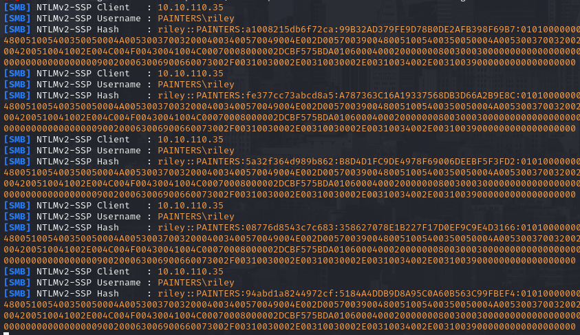
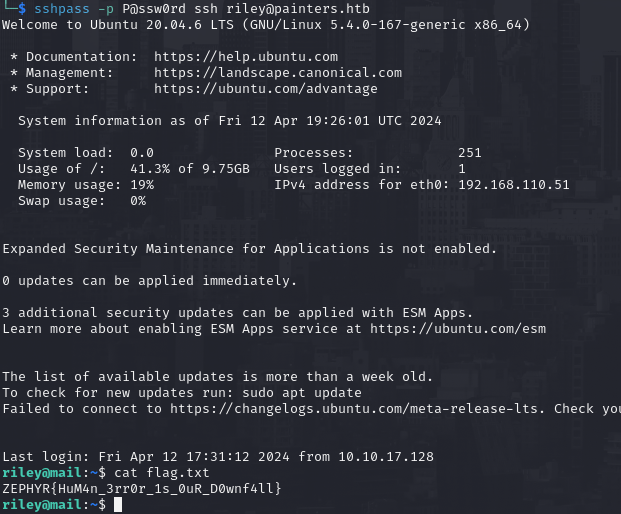

# id

* class Phishing
* lorem

# title

Phishing

# description
Phishing needs no presentation is an attack vector known even by non-technical people and is still one of the favorite TTPs by APT. There are different
way to perform it : VBA script, HTA, and XXL are just a few examples that are used for the attack-chain. The general attack flow is the same, we try to convince
the user to download/view/use a malicious attachment delivered in specific way, camouflate as legittimate and automate the malicious actions everything executed with
the right spice of social engineering. Obviously is not simple at it seems other invisible threat (like AV) needs to be handled as well but in this final mini-report I wanted
to cover the first part of the **Zephyr ProLab** (HackTheBox) where a simple but effective phishing method has been used to get initial access inside the victim network

**Context**

**Zephyr** first flag (*The Premonition*) start with just a linux webserver that rely on a full AD infrastructure, through this webserver we can upload PDF for the "Vacancies" section, using a crafted 
PDF I was able to retrieve NTLMv2 hashes changing the **/AA** field and pointing it to Responder SMB. The real difference with "traditional phishing" (where a sort of reverse shell would occur or fake login form setup)
is that we steal silently without direct user action, just opening the PDF is necessary.

# evidence

## painters.htb
Enumeration of **painters.htb** website (the hostname of the machine is *mail.painters.htb* so my creativity would assume is also a mailserver for the sake of the challenge) ended with the discovery of three different Job Apply form {!REF:5:PREMONITION:issue.md:issue51.png!} each of them allow to upload a PDF and send it for review {!REF:5:PREMONITION:issue.md:issue52.png!}.
A PDF file can be really threatening when but only with the right information and weaponization. Hacking is not just about tools and techniques (remember what we said about users in the introduction?) but use of simple logic can clean up our head and under-
standing. The "staff" would unlikely being some IT guy but maybe someone from HR or non-informatic specialist and we expect this type of professionals to log into SSH on a web
server and use the bash to retrieve our PDF? Probably this PDF would be uploaded on the Linux machine and than passed somewhere else, we in an AD lab so 99% of chance that
this "else" is going to be a Windows machine. With some research I discover the [BADPDF](https://www.infosecmatter.com/metasploit-module-library/?mm=auxiliary/fileformat/badpdf) module in metasploit which would
create (or change) a PDF tuning the **/AA** field. this field contains 3 different variable:

* **/S** = The type of action to perform, we would use the GoToR (*Go To Remote*) which would tell the PDF editor the following variable needs to be fetched outside the document (outside means everything, even the machine itself)
* **/F** = This is the key point, here we can specify a remote file which in our case should be our malicious SMB server *\\\\[IP]\\[FILE]*
* **/D** = The location of the fetched document to extract, not relevant for out purposes

The PDF creation is made really simple thanks to metasploit and after generating it we should go and upload on every upload form available to grab as much hash as possible. 
After some minutes Responder will start to flood {!REF:5:PREMONITION:issue.md:issue53.png!}, that's great! Our intuition was right, the PDF has been opened on a Windows machine! 
using **hashcat** I cracked the Riley hash and get the plaintext (*P@ssw0rd*) and used on the SSH port of the mail/web server, luckly the password policy was not strong enough and allowed to reuse password in this linux machine 
and grab the first flag! {!REF:5:PREMONITION:issue.md:issue54.png!}.
Later on I have set up this machine as pivot to connect on the internal network and start playing with AD protocols moving further and further.

**SSVC Decision**

* **Exploitation = Active**, Phishing is still one of the most used technique in the wild, even with job boards or online forms (look what happened to [Europol](https://beyondmachines.net/event_details/europol-confirms-portal-hack-claims-no-operational-data-impacted-g-0-8-y-a) in these days, lol)
* **Automable = Yes**, Weaponization, delivery and exploitation are fully automable
* **Technical Impact = Partial**, retrieving user hash is cool but doesn't automatically means that we have full control on the vulnerable component (the webserver)
* **Mission & Well-Being = High**, in this specific case we get controll of the web and mail server with a single stone. These 2 components are foundamental for the security and mission posture of the client
* **Decision = Act**, the sum of the previous choices

# affected assets

* mail.painters.htb

# severity

Act
SSVCv2/E:A/A:Y/T:P/P:S/B:I/M:H/D:C

# recommendations

* Is the third time in this paper, password policy needs to be reviewed from the start. No need to use the same passwords into 2 different machine especially if one of them is an important component of the infrastructure
* Zero-Trust approach on everything that originate from the outside, use detection room or sandbox when you need to open unknown files.
* Take care of outgoing and upcoming connection from untrusted source, if there is no needs that a machine inside AD needs to access a public facing SMB use the firewall to kill this connections (same thing applied to similar connections)

# references

* The ProLab is under paywall and public walkthrough cannot be pubblished until the lab is active. I have attached on the email my full walkthrough in orderto be reviewed without breaking HTB labs 

# images

* 
* 
* 
* 
